# TalentScape: Mapping Employee Trends with Interactive Analytics

## Overview
The HR Dashboard is a data visualization and analytics tool designed to help Human Resources (HR) managers efficiently analyze workforce data. The dashboard provides a comprehensive overview of key HR metrics, enabling managers to make data-driven decisions regarding hiring, employee retention, diversity, compensation, and workforce planning.

The dashboard is divided into two main sections:

- **Summary View** - Offers high-level insights through visualizations and aggregated data.

- **Employee Records View** - Provides detailed employee information with filtering capabilities for in-depth analysis.

### Key Features of the HR Dashboard
**1. Summary View**
The Summary View is structured into three key sections: Overview, Demographics, and Income Analysis, each providing critical insights into workforce dynamics.

**A. Overview**
This section gives a snapshot of the organization’s workforce, including:

- Total Employees: Breakdown of hired, active, and terminated employees
  Hiring Trends: Visualization of hiring and termination trends over the years.
- Department & Job Title Distribution: Employee distribution across departments and roles.
- Location Analysis: Comparison of employees in Headquarters (HQ) vs. branches, along with distribution by city and state.

**B. Demographics**
This section provides insights into the composition of the workforce, including:

- Gender Ratio: Male vs. female employee distribution.
- Age & Education Analysis:

    - Distribution of employees across different age groups.

    - Breakdown of employees by education level (e.g., High School, Bachelor’s, Master’s, PhD).

    - Education vs. Performance: Correlation between employees' education levels and their performance ratings.

**C. Income Analysis**
This section focuses on salary trends and disparities, including:

Salary by Education & Gender: Comparison of salaries across education levels for both genders to identify pay gaps.

Age vs. Salary Correlation: Analysis of how age impacts salary within different departments.

**2. Employee Records View**
This section provides a detailed, filterable list of all employees, allowing HR managers to access specific records based on criteria such as:

- Name, Department, Job Title
- Gender, Age, Education Level
- Salary, Performance Ratings

Users can apply filters to quickly locate employees matching specific attributes, facilitating targeted workforce management.

---
---

## Data Visualization using Tableau

### Introduction

#### Overview

The HR Dashboard is a data visualization and analytics tool designed to help Human Resources (HR) managers efficiently analyze workforce data. The dashboard provides a comprehensive overview of key HR metrics, enabling managers to make data-driven decisions regarding hiring, employee retention, diversity, compensation, and workforce planning.
Key Features of the HR Dashboard
**1. Summary View**
The Summary View is structured into three key sections: Overview, Demographics, and Income Analysis, each providing critical insights into workforce dynamics.

**A. Overview**
This section gives a snapshot of the organization’s workforce, including:
Total Employees: Breakdown of hired, active, and terminated employees
Hiring Trends: Visualization of hiring and termination trends over the years.
Department & Job Title Distribution: Employee distribution across departments and roles.
Location Analysis: Comparison of employees in Headquarters (HQ) vs. branches, along with distribution by city and state.

**B. Demographics**
This section provides insights into the composition of the workforce, including:
Gender Ratio: Male vs. female employee distribution.
Age & Education Analysis:
Distribution of employees across different age groups.
Breakdown of employees by education level (e.g., High School, Bachelor’s, Master’s, PhD).
Education vs. Performance: Correlation between employees' education levels and their performance ratings.

**C. Income Analysis**
This section focuses on salary trends and disparities, including:
Salary by Education & Gender: Comparison of salaries across education levels for both genders to identify pay gaps.
Age vs. Salary Correlation: Analysis of how age impacts salary within different departments.

#### 2. Employee Records View
This section provides a detailed, filterable list of all employees, allowing HR managers to access specific records based on criteria such as:
Name, Department, Job Title
Gender, Age, Education Level
Salary, Performance Ratings

Users can apply filters to quickly locate employees matching specific attributes, facilitating targeted workforce management.

---

### Tasks Completed

#### Task 1: HR Data Generation

The first phase of the project involved generating a synthetic HR dataset to support the development of an analytics dashboard. The synthetic HR dataset was systematically generated using Python, leveraging key libraries such as Faker for realistic fake data. A total of 8,950 employee records were created, simulating a mid-to-large Kenyan organization. The dataset was designed with realistic distributions, including geographic weighting (40% Nairobi to reflect HQ concentration), department sizes (Operations as the largest at 30%, HR the smallest at 2%), and demographic ratios (46% female, 54% male). Employment patterns were modeled with historical hiring trends (peaking in 2017) and an 11.2% termination rate, ensuring terminations occurred only after a minimum 6-month tenure.

The data generation process incorporated key business rules to enhance realism. Salaries were structured by department and role, with adjustments for education level (e.g., PhD holders received higher premiums) and gender (introducing controlled pay gap patterns). Age-based salary increments (0.1–0.3% per year) and performance ratings (12% "Excellent," 8% "Needs Improvement") added further depth. Technical implementation used Python with Faker and Pandas, enforcing reproducibility through fixed random seeds (42) and validation checks for data consistency, such as ensuring termination dates followed hire dates and manager roles required higher education.

---

#### Task 2: Building Data Source
The objective of this task is to establish a reliable and optimized data pipeline for the dashboard by connecting, cleaning, and structuring the raw data in Tableau

**Connecting to Data Source** - First I was able to connect the Tableau Desktop to the csv file via Text File connector. 
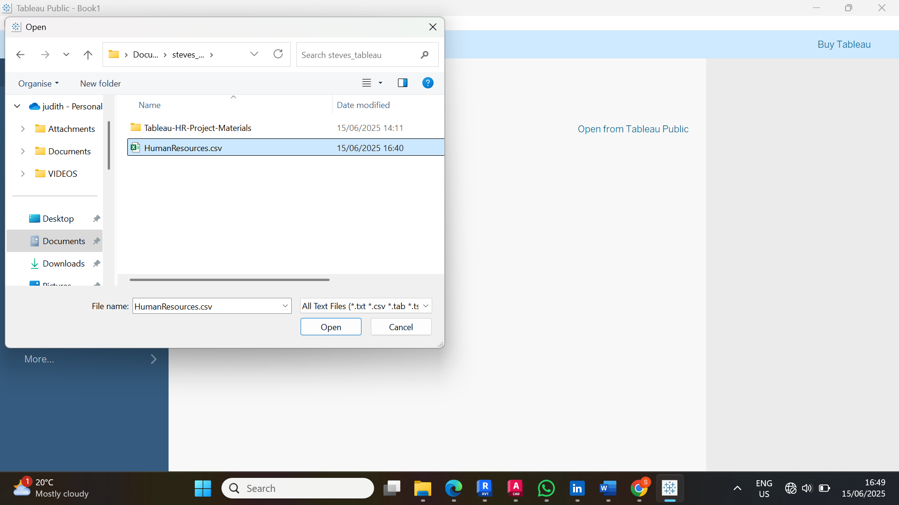

**Building Data Models** - I did build data models by creating hierarchies for example Department - Job Title, and defined calculated fields. 

**Checking Data Quality** - I was able to check data quality whereby Null values were flagged using Tableau’s “Highlight Nulls” feature, and inconsistencies were corrected. 

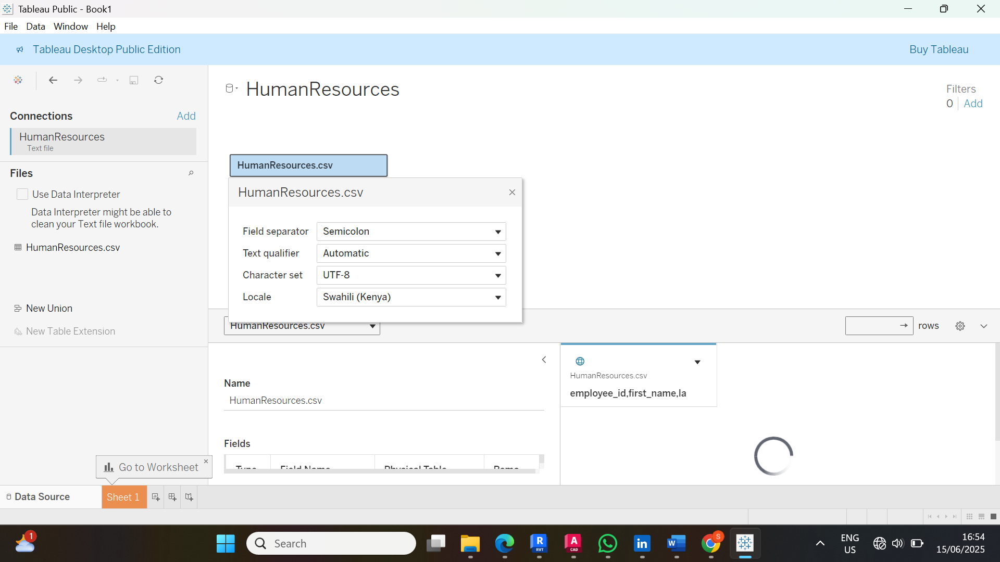

**Verification of Data Types** - I then verified data types. I assigned appropriate data types and standardized categorical fields.

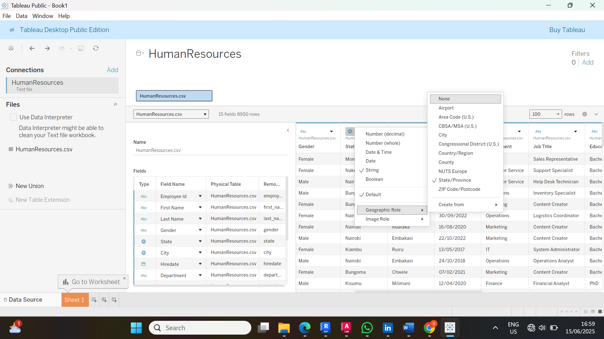

Finally in task 2, I was able to **understand and explore the data** further. I was able to group similar job titles, creating draft visualizations. 
The processed dataset was now optimized for dashboard development, ensuring reliable and actionable HR Insights.

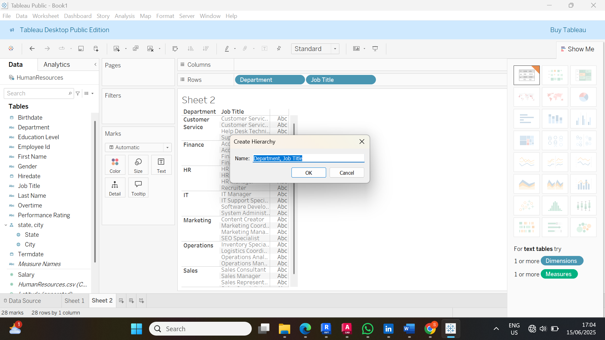

---

### Task 3: Building Charts in Tableau
The objective of this task is to transform HR data into meaningful visualizations that align with dashboard requirements. For example using Bans and graphs where necessary.

**- Analyze Requirements** - I was able to analyze requirement and select the best chart. I reviewed the user story and identified key metrics like:
- Overview  - Employee count, hiring trends, and department distributions
- Demographics - Age, and gender distribution, educational levels.
- Income - Salary by role/ education, pay gap analysis.
  
Selected Appropriate Charts - I then selected appropriate chart types:
- BANS - Total employees,e.t.c
- Line charts - Hiring trends, e.t.c.
- Bar charts - Location e.t.c
- Heatmaps - Education and performance
- Scatter plots - Age vs Salary

**Building Charts** - Next I was able to build the charts step by step.

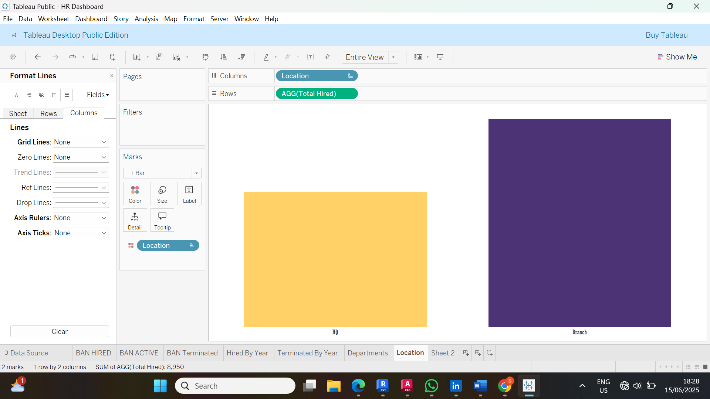

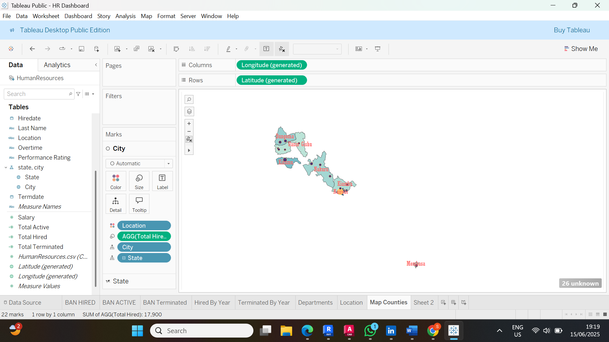

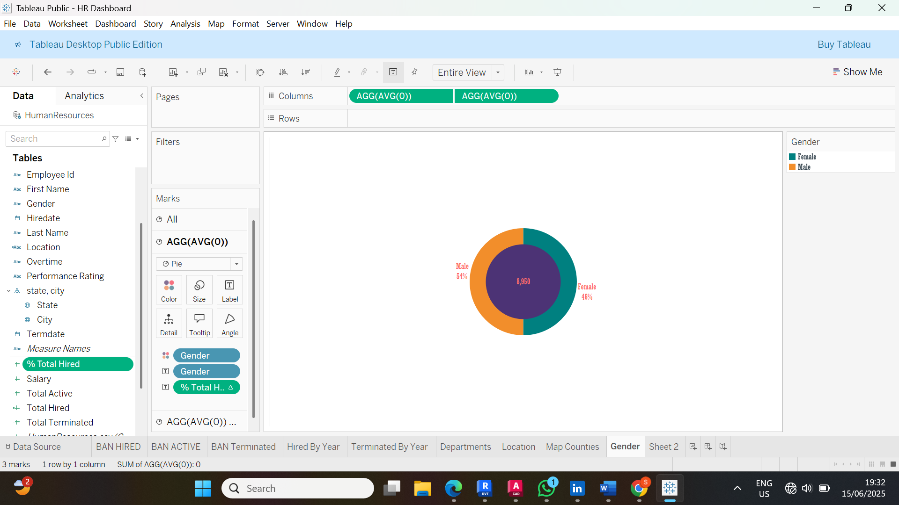

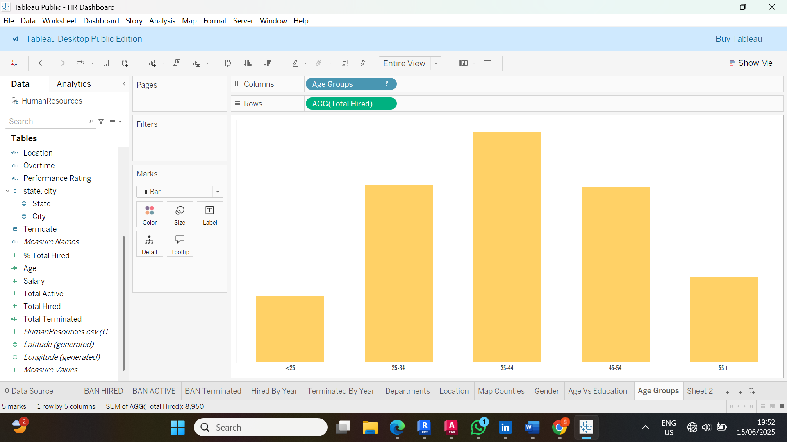

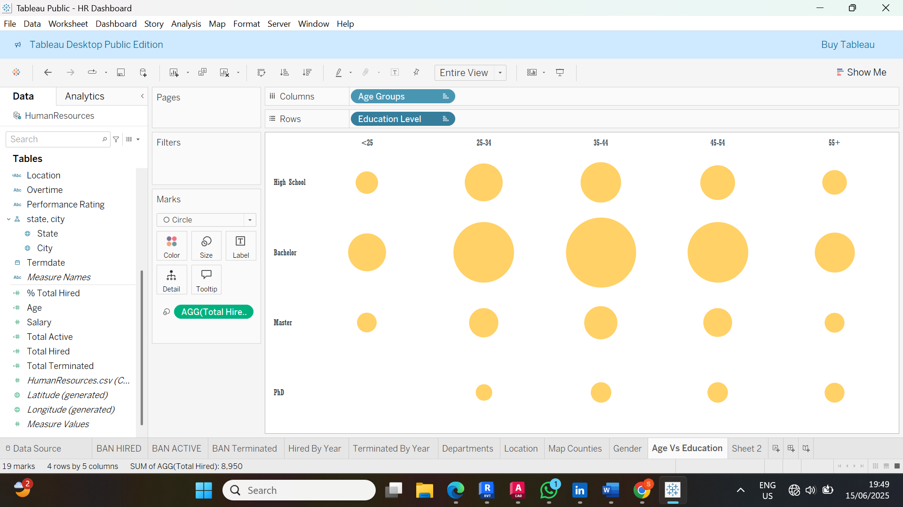

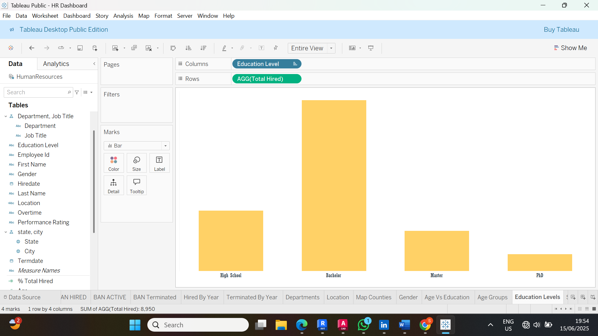

Next I was able to apply corporate **branding** like font, color and layout.

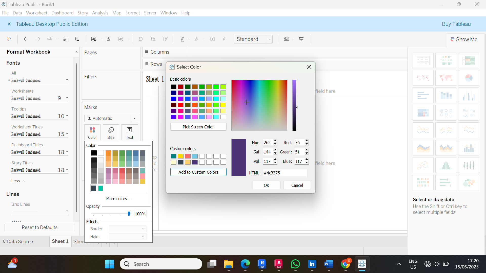

**Calculated Fields** - Next I created calculated fields and tested. 

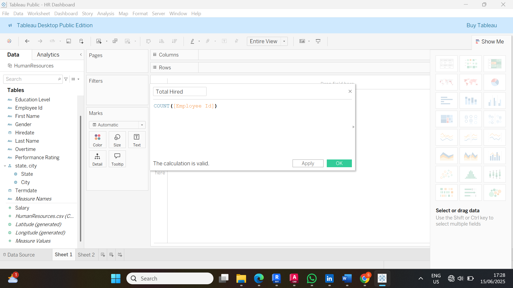

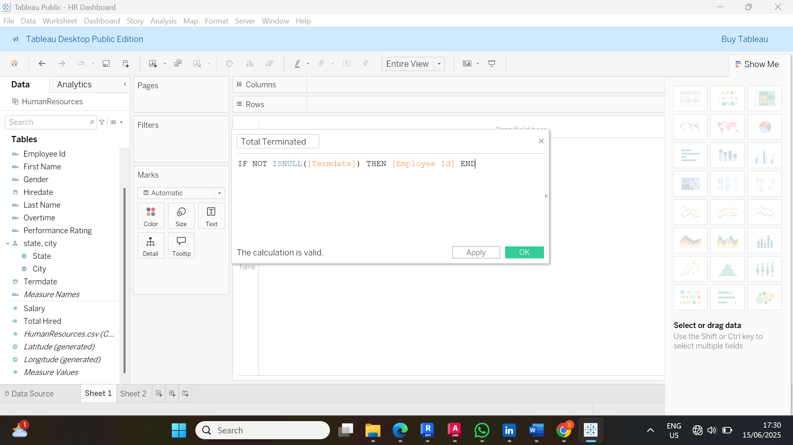

**Format Charts** - After building the charts, I was able to format the charts by optimizing them for example adjusting axis ranges, adding dynamic titles, aligning legends and labels. 

---

### Task 4: Building Dashboards in Tableau
The objective of this task was to assemble individual charts into an interactive HR analytics dashboard.
**Dashboard planning and mockup** -   I did the dashboard planning and mockup. I designed the wireframe in drawio aligning with the user story. 
- The top section - summary BANS
- Middle Section - Trend/ Demographic charts
- Bottom Section - Detailed employee table with filters

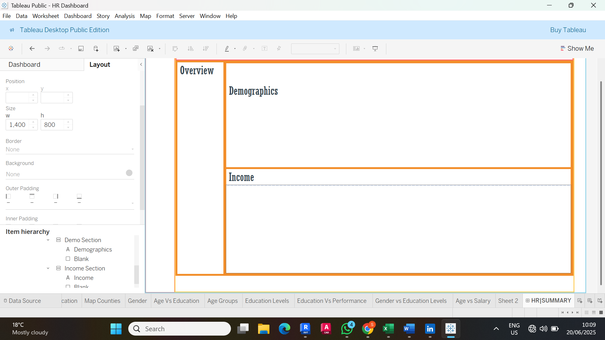

**Container structuring** - I used tiled containers for alignments and floating elements for overlays like info container.
**Assembling of charts** - Next I assembled charts in designated containers and established dependencies.

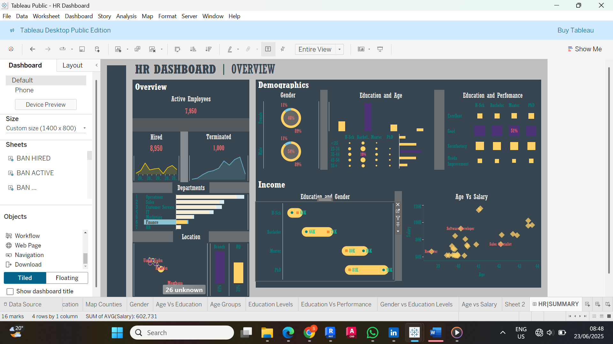

**Color standardization** - I applied consistent palette accross the dashboard.

**Chart refinements** - I refined the charts by adjusting dashboard context e.g simplifying axes, unified max sizes across scatter plots, and added reference lines like average salary.
**Text Optimization** - Next I did text oprimizations by standardizing formatting for titles, labels, and dynamic titles.

**Spacing and Alignment, and Tooltip** - Next I did spacing and alignment by using padding in and out of containers. I was also able to add tooltip and hover effects on charts for more informations.

**Interactive Elements** - Next I added interactive elements like filters like dropdown for age, department.
**Branding Elements** - Finally I added branding elements like logo and custom icons.

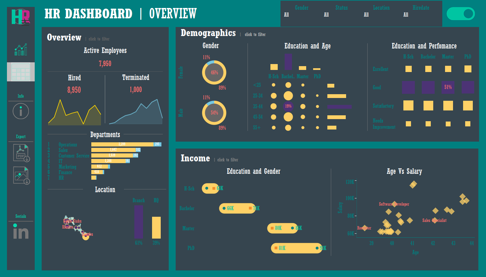

---

### Conclusion

This project successfully transformed raw data into actionable insights through a structured, user-centric approach. Beginning with synthenctic data generation, I ensured realistic distributions for key HR metrics. In Tableau, I meticulously prepared the data, built interactive visualizations, and assembled a polished dashboard with intuitive navigation.
The final dashboard delivered clear insights, interactivity, and professional presentations. This project demonstrates how thoughtful data visualizations can turn complex HR Data into strategic tools for workforce management. 

