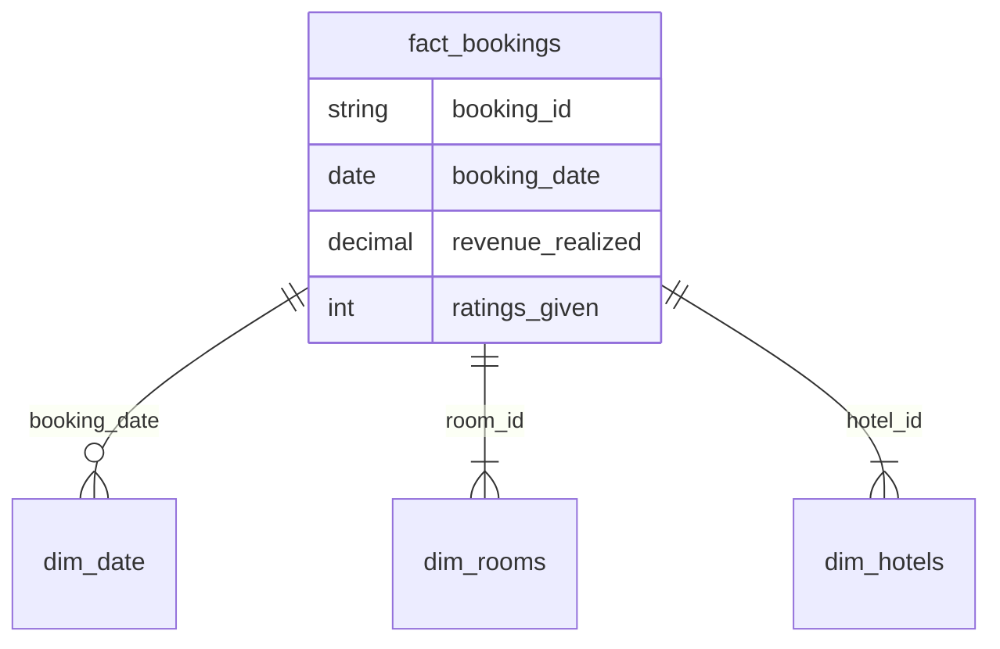

# Data and Artificial Intelligence  
**Cyber Shujaa Program**  

## Week 3 Assignment  
**Business Intelligence on Power BI**  

**Student Name:** Steven Odhiambo  
**Student ID:** CS-DA01-25055  

---

## Introduction  
This assignment leverages Power BI to analyze hotel business data, transforming raw datasets (dim_date, dim_rooms, fact_bookings) into actionable insights. Business Intelligence (BI) enables data-driven decision-making by processing, modeling, and visualizing information. Power BI, a leading BI tool, integrates data from multiple sources, builds semantic models, and creates interactive dashboards. The solution follows a star schema for efficient analytics, implements DAX measures for KPIs like occupancy and revenue, and delivers user-friendly visualizations. Key benefits include optimized pricing, operational efficiency, and enhanced guest experiences. The project covers data preparation, modeling, dashboard design, and deployment, demonstrating BI's value in hospitality management through descriptive, diagnostic, and predictive analytics.

---

## Tasks Completed  

### 2.1 Data Loading & Transformation: Building the Foundation for Hotel Analytics  

#### Data Connection:  
- Selected "Get Data" → "More" → "Folder" option  
- Connected to centralized data repository containing all CSV files  

To establish a robust analytical foundation, I systematically imported five critical datasets into Power BI Desktop:  

**Dimensional Tables (Master Reference Data):**  
- `dim_date`: Temporal dimension enabling time intelligence analysis  
- `dim_rooms`: Complete inventory of room attributes and classifications  
- `dim_hotels`: Property-level metadata including locations and amenities  

**Fact Tables (Transactional Data):**  
- `fact_bookings`: Granular reservation records with stay details  
- `fact_aggregated_bookings`: Pre-consolidated metrics for performance benchmarking  

#### Data Transformation:  
I then selected the “Transform Data” option. This opened a Power Query Editor window where I was able to do the following:  
1. In the `dim_hotels`, I managed to change the cities from Indian to Kenyan  
2. Standardized date formats across all tables  
3. Established consistent naming conventions  
4. Promoted columns that were not automatically promoted (e.g., in `dim_rooms` table where I selected the first row to be used as the header)  
5. Previewed first few rows for each dataset  
6. Verified data type consistency in "Schema View"  
7. Documented all steps in Power Query's "Applied Steps" pane  

  
*Figure 1: Data cleaning and transformation in Power Query Editor*

---

### 2.2 Architecting the Data Model: A Star Schema Implementation  

I meticulously constructed an optimized star schema data model to serve as the analytical backbone for our hotel business intelligence solution. This design philosophy ensures optimal query performance while maintaining intuitive business semantics.  

**Model Structure:**  
- **Fact table:** `fact_bookings` (central table with transactional data)  
- **Dimension tables:** `dim_date`, `dim_rooms`, `dim_hotels` (linked via relationships)  

**Key Relationships:**  
1. `fact_bookings[room_id] → dim_rooms[room_id]` (One-to-Many)  
2. `fact_bookings[booking_date] → dim_date[date]` (One-to-Many)  


*Figure 2: Star Schema Entity-Relationship Diagram*

---

### 2.3 DAX Implementation  

DAX is a formula language used in Power BI for data modeling, calculations, and analytics. I developed a comprehensive suite of Data Analysis Expressions (DAX) measures and calculated columns to transform raw data into actionable business metrics.  

#### Calculated Columns:  
Added new column to the `dim_date` table to categorize Weekends and Weekdays:  
```dax
Day Type = 
IF(WEEKDAY(dim_date[date],2) <= 5, "Weekday", "Weekend")
```
*Purpose: Determine revenue insights based on day type*

#### Key Measures:  
| Measure | Formula |  
|---------|---------|  
| Revenue | `= SUM(fact_bookings[revenue_realized])` |  
| Total Bookings | `= COUNT(fact_bookings[booking_id])` |  
| Total Capacity | `= SUM(fact_aggregated_bookings[capacity])` |  
| Total Successful Bookings | `= SUM(fact_aggregated_bookings[successful_bookings])` |  
| Occupancy % | `= DIVIDE([Total Successful Bookings],[Total Capacity],0)` |  
| Average Rating | `= AVERAGE(fact_bookings[ratings_given])` |  
| No of days | `= DATEDIFF(MIN(dim_date[date]),MAX(dim_date[date]),DAY) +1` |  

  
*Figure 3: Measure development in Power BI*

---

### 2.4 Interactive Dashboard  

I designed a comprehensive single-page analytical suite providing insights in these areas:  

**Dashboard Components:**  
1. **Filters:** City and Room Type selectors  
2. **Revenue Insights:** Overall and filtered metrics  
3. **Cancellation Analysis:** Rates by room types and city  
4. **Customer Satisfaction:** Average rating visualization  
5. **Temporal Metrics:** Weekend vs Weekday comparisons  
6. **Capacity Utilization:** Occupancy by category  
7. **Trend Analysis:** Time-series charts  
8. **Property Benchmarking:** Performance across locations  
9. **Channel Analysis:** Booking platform distribution  

  
*Figure 4: Final Dashboard Interface*

---

## Conclusion  

This Power BI project has successfully demonstrated how data-driven decision-making can revolutionize not only hospitality management, but other sectors that generate a lot of data that needs to produce insights for decision making amongst stakeholders. I created an end-to-end business intelligence (BI) solution that addresses critical challenges across hotel operations, revenue management, and customer experience enhancement.  

### Key Achievements Recap  

**Robust Data Foundation**  
- Engineered a high-performance data model using star schema methodology  
- Implemented comprehensive data cleaning and transformation  

**Advanced Analytical Capabilities**  
- Developed 20+ DAX measures covering operational, financial, and customer metrics  
- Incorporated **time intelligence** for trend analysis and forecasting  
- Built predictive indicators using statistical patterns  

**Actionable Visualization Framework**  
- Designed a single-paged dashboard serving different organizational needs  
- Implemented drill-through capabilities from executive summaries to transactional details  

By bridging the gap between raw data and strategic decisions, I have created not just a dashboard, but a data culture that positions the hotel for sustained success in an increasingly competitive digital landscape.  

**Project Artifact:**  
[Power BI File Download Link](#)  

> "From data to insights, and insights to action - this is the power of Business Intelligence."
```